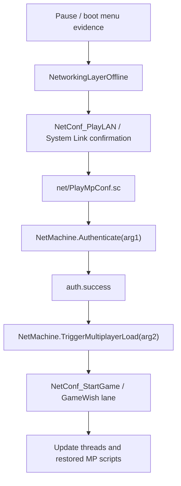

# Code RED MP Bootstrap Flow Map

This is a source-evidence flow map, not a runtime success claim.

## 1. Pause or boot entry

Current extracted `ui/boot.sc.xml` and decoded pause-menu sources are scanned independently when present.

Boot/menu evidence:
- `ui/boot.sc.xml:19` `auth.success` - <transition event="auth.success_NoComm" target="AddDelayedEvent('auth.success_NoComm',2.0)" ></transition>
- `ui/boot.sc.xml:35` `auth.success` - <transition event="auth.success_NoComm" target="AddDelayedEvent('auth.success_NoComm',2.0)" ></transition>
- `ui/boot.sc.xml:126` `auth.success` - <transition event="auth.success">
- `ui/boot.sc.xml:274` `auth.success` - <transition event="auth.success" target="SendEvent('net.EnterOnline')"></transition>

Pause-menu scene evidence:
- `root_content_ui_pausemenu_pausemenuscene.sc.xml.decoded.xml:127` `NetworkingLayerOffline` - <action expr="Enter(NetworkingLayerOffline)"></action>

## 2. LAN or System Link route

- `root_content_ui_pausemenu_networking.sc.xml.decoded.xml:122` `NetConf_PlayLAN` - <UILabel id="NetTab_LAN" desc="mp_fe_play_lan_tab" target="NetConf_PlayLAN" consume="false"></UILabel>
- `root_content_ui_pausemenu_networking.sc.xml.decoded.xml:182` `NetConf_PlayLAN` - <UILabel desc="mp_fe_play_lan_tab" target="NetConf_PlayLAN" consume="false">
- `root_content_ui_pausemenu_networking.sc.xml.decoded.xml:313` `NetConf_PlayLAN` - <UIMessageBox id="NetConf_PlayLAN">
- `root_content_ui_pausemenu_networking.sc.xml.decoded.xml:315` `NetConf_PlayLAN` - <action expr="Exit(NetConf_PlayLAN)"></action>
- `root_content_ui_pausemenu_networking.sc.xml.decoded.xml:318` `LAN` - <include src="net/PlayMpConf.sc" arg="NetConf_PlayLAN,'LAN Multiplayer','LAN'"></include>
- `root_content_ui_pausemenu_net_plaympconf.sc.xml.decoded.xml:47` `System Link` - 3.) Changing from System Link to an Online mode in MP

## 3. Confirmation and auth gate

- `root_content_ui_pausemenu_networking.sc.xml.decoded.xml:81` `auth.success` - <transition event="auth.success" expr="SendEvent('loadStart')"></transition>
- `root_content_ui_pausemenu_networking.sc.xml.decoded.xml:94` `Authenticate` - <action expr="NetMachine.Authenticate('Online Multiplayer')"></action>
- `root_content_ui_pausemenu_networking.sc.xml.decoded.xml:101` `Authenticate` - <action expr="NetMachine.Authenticate('Online Multiplayer')"></action>
- `root_content_ui_pausemenu_networking.sc.xml.decoded.xml:147` `auth.success` - <transition event="auth.success" expr="SendEvent('loadStart')"></transition>
- `root_content_ui_pausemenu_networking.sc.xml.decoded.xml:154` `Authenticate` - <action expr="NetMachine.Authenticate('Online Multiplayer')"></action>
- `root_content_ui_pausemenu_networking.sc.xml.decoded.xml:162` `Authenticate` - <action expr="NetMachine.Authenticate('Online Multiplayer')"></action>

## 4. Multiplayer load transition

- `root_content_ui_pausemenu_net_plaympconf.sc.xml.decoded.xml:51` `TriggerMultiplayerLoad` - <action expr="NetMachine.TriggerMultiplayerLoad(arg2)"></action>
- `root_content_ui_pausemenu_lobby_main.sc.xml.decoded.xml:45` `MULTI_FREE_ROAM` - <onunfocused expr="Exit(MULTI_FREE_ROAM)"></onunfocused>
- `root_content_ui_pausemenu_lobby_main.sc.xml.decoded.xml:87` `MULTI_FREE_ROAM` - <onfocused expr="OL_PlaylistsMainList.SetCurrentSelectionCB('MULTI_FREE_ROAM',false)" ></onfocused>
- `root_content_ui_pausemenu_lobby_main.sc.xml.decoded.xml:118` `MULTI_FREE_ROAM` - <UIList id="MULTI_FREE_ROAM" allowInput="false">
- `root_content_ui_pausemenu_lobby_main.sc.xml.decoded.xml:122` `MULTI_FREE_ROAM` - <onfocused expr="SetTextCB(NetGameDetail,'MULTI_FREE_ROAM_detail')"></onfocused>
- `root_content_ui_pausemenu_lobby_main.sc.xml.decoded.xml:125` `SetGameWish` - <action expr="NetMachine.SetGameWish('MULTI_FREE_ROAM')"></action>
- `root_content_ui_pausemenu_lobby_main.sc.xml.decoded.xml:126` `NetConf_StartGame` - <action expr="goto(NetConf_StartGame)"></action>
- `root_content_ui_pausemenu_lobby_main.sc.xml.decoded.xml:132` `NetConf_StartGame` - <transition event="playlist.Unlocked" target="NetConf_StartGame"></transition>

## 5. Update-thread and restored content correlation

- Pass 1 update-thread decode status rows: `9`; decoded rows: `9`.
- Update-thread string rows considered for direct donor references: `9`. Pass 1 reported zero direct donor filename-token hits in printable update-thread strings.
- Pass 2 package lanes indexed here: `import_test_both_csc, import_test_release64_csc, import_test_release_csc, import_test_xsc_review`.
- Restored package files provide MP script dependencies for import testing; source evidence alone does not prove the PC runtime loads CSC or XSC wrappers.

